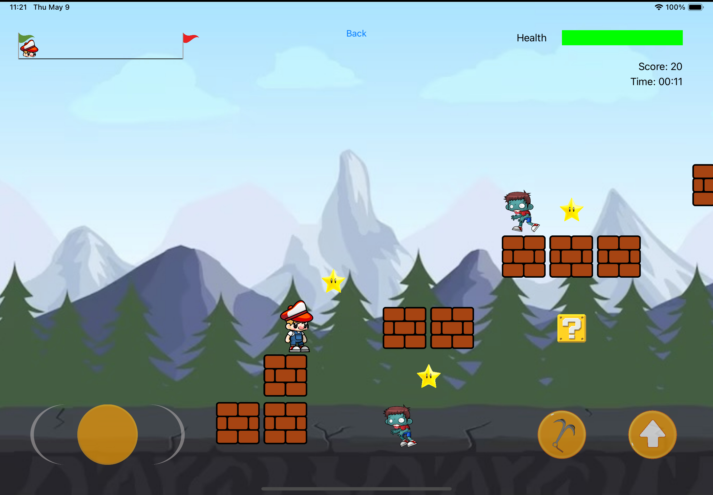

## About
Star Dash is a Super Mario Bros inspired platformer to challange your friends in! With power ups and various movement methods such as flying, the game is immensely fun when competing with your friends over local and online multiplayer.

Star Dash is written in Swift and targeted at iPad users.

## Features
- Game Mode: Racing, score-based 
- Power-Ups: Faster movement, homing missile
- Various Movements: Fly, Grapple Hook
- Monsters
- Achievements

## Screenshots
 
### Menu

### Singleplayer

### Local Multiplayer

## Usage Guide

Find the usage guide in the [final project report](./docs/StarDash_Final%20Project%20Report.pdf)

## Design

Star Dash is written entirely in `Swift` and uses `SpriteKit` as a physics engine. The game engine follows an **entity component system (ECS)** architecture to contain and manipulate game objects. 

The following diagram is a higher-level view of our game-related class diagram.

Further details into each component and specific features are found in the [final project report](./docs/StarDash_Final%20Project%20Report.pdf)
